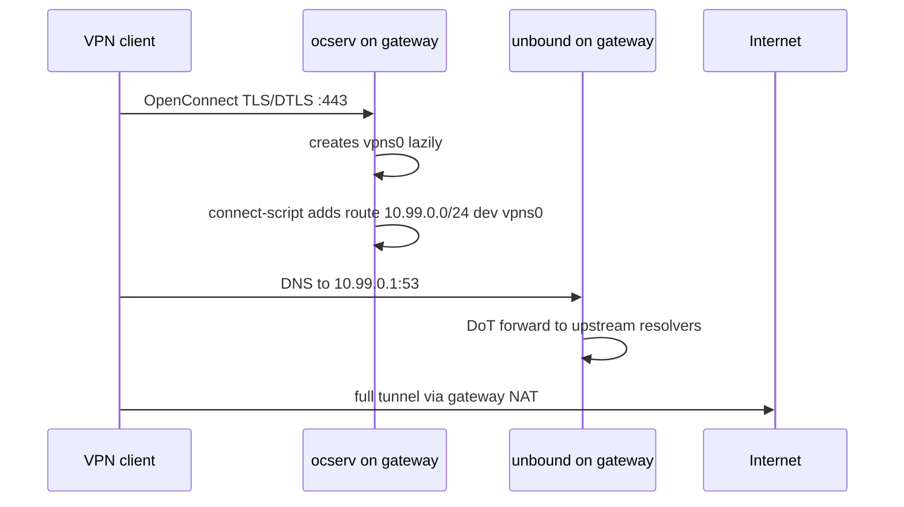
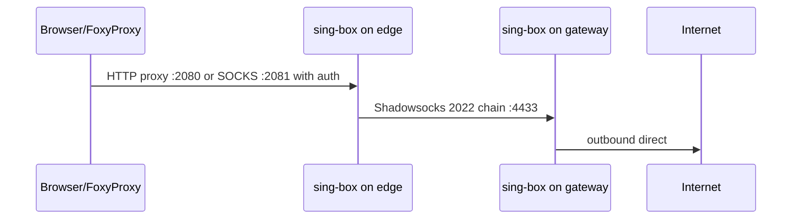
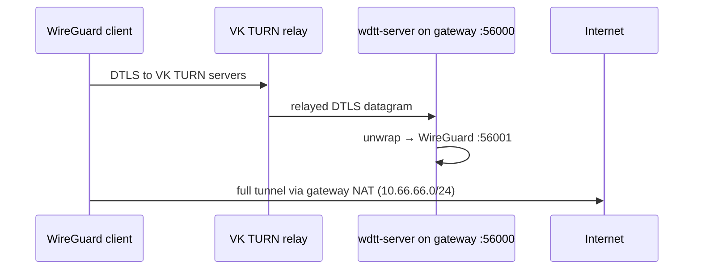
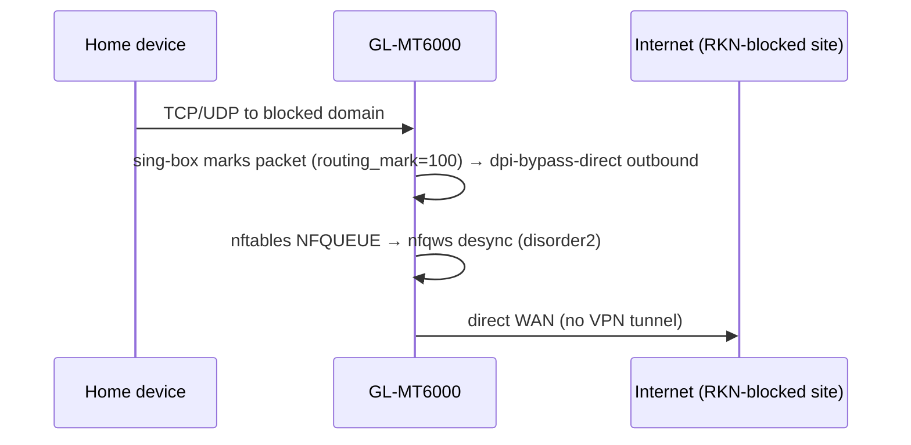
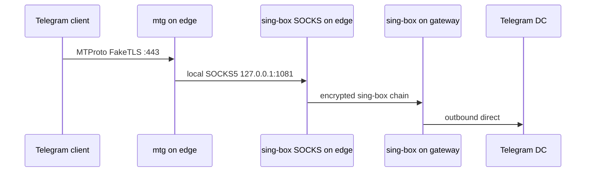

# Архитектура проекта

## Назначение

Проект автоматизирует разворачивание домашней двухузловой VPN/proxy-инфраструктуры на Ubuntu 24.04.

Целевой результат:

- полнотуннельный OpenConnect/AnyConnect VPN для ноутбуков и мобильных клиентов;
- браузерный HTTP/SOCKS proxy для выборочной маршрутизации через FoxyProxy;
- Telegram MTProto proxy на публичном edge-узле;
- egress через отдельный gateway-узел;
- воспроизводимый Ansible-deploy после reboot или переустановки сервера.

## Узлы

| Логическое имя | Inventory group | Назначение | Основные сервисы |
|---|---|---|---|
| Edge VPS | `ru_vps` | публичная точка входа для Telegram и браузерного прокси | nginx, mtg, sing-box |
| Gateway VPS | `de_vps` | VPN concentrator, WDTT relay и внешний egress | ocserv, unbound, sing-box, wdtt |
| Роутер | `routers` | прозрачный proxy для домашней сети + DPI-обход | sing-box TUN, nfqws |

Названия групп исторические. В публичной версии их можно трактовать как `edge_vps` и `gateway_vps`.

## Потоки трафика

### 1. VPN-клиент -> Gateway -> Internet

### 2. Browser -> Edge proxy -> Gateway -> Internet

### 4. WireGuard client -> WDTT -> Gateway -> Internet

Преимущество: DTLS через публичные TURN-серверы VK пробивает большинство NAT без проброса портов на клиентской стороне.

### 5. Роутер: DPI-обход через nfqws (опционально)

> По умолчанию `dpi_bypass_domains` пуст — все РКН-заблокированные сайты идут **через туннель** до gateway (категория `final: proxy`), мимо nfqws и ТСПУ. Схема ниже работает только для доменов, явно добавленных в `dpi_bypass_domains`.

nfqws перехватывает пакеты с `routing_mark={{ nfqws_routing_mark }}` через NFQUEUE, блокирует QUIC (UDP/443) и десинхронизирует TCP-хэндшейки (disorder2, split). Список доменов задаётся в `dpi_bypass_domains` (по умолчанию пуст). Шаблон `flint_singbox/config.json.j2` оборачивает правила dpi-bypass в ``, поэтому пустой список даёт валидный конфиг без этой категории.

> **Домены Meta нельзя класть в `dpi_bypass_domains` с резолвом через Яндекс.** См. предупреждение в split-DNS ниже.

### 3. Telegram -> Edge mtg -> Gateway -> Telegram

## Порты

### Edge

| Порт | Протокол | Bind | Сервис | Назначение |
|---:|---|---|---|---|
| 22 | TCP | public | sshd | управление |
| 80 | TCP | public | nginx/certbot | ACME HTTP-01 |
| 443 | TCP | public | mtg/nginx | Telegram MTProto FakeTLS / fronting |
| 8388 | TCP/UDP | public | sing-box `router-in` | legacy SS2022 leg home→edge (режется ТСПУ) |
| 39443 | UDP | public | sing-box `hy2-in` | leg home→edge **primary**: hysteria2 + obfs salamander (LE-серт edge) |
| 8843 | TCP | public | sing-box `shadowtls-in` | leg home→edge **fallback**: shadowtls v3 → внутр. SS2022 |
| 1080 | TCP | loopback | sing-box | локальный HTTP proxy |
| 1081 | TCP | loopback | sing-box | локальный SOCKS proxy |
| 2080 | TCP | public | sing-box | HTTP proxy с auth |
| 2081 | TCP | public | sing-box | SOCKS proxy с auth |

### Gateway

| Порт | Протокол | Bind | Сервис | Назначение |
|---:|---|---|---|---|
| 22 | TCP | public | sshd | управление |
| 80 | TCP | public | certbot standalone | ACME HTTP-01 для ocserv |
| 443 | TCP/UDP | public | ocserv | OpenConnect/AnyConnect VPN |
| 4433 | TCP | public, restricted by firewall | sing-box | ingress с edge-узла |
| 53 | TCP/UDP | VPN interface | unbound | DNS для VPN-клиентов |
| 56000 | UDP | public | wdtt-server | WireGuard over DTLS/VK TURN |
| 56001 | UDP | loopback | wdtt-server | внутренний WireGuard listener |

## Адресация VPN

По умолчанию (ocserv):

- VPN network: `10.99.0.0/24`
- gateway/DNS: `10.99.0.1`
- ocserv device base: `vpns`
- runtime interface: `vpns0`

WDTT WireGuard:

- subnet: `10.66.66.0/24`
- пользователи и ключи управляются через `passwords.json` в `{{ wdtt_config_dir }}`; доступны Telegram-команды при наличии бота

Особенность: `vpns0` появляется только после подключения первого клиента. Поэтому постоянный Ansible task вида `ip route replace 10.99.0.0/24 dev vpns0` неидемпотентен на холодном сервере. В проекте маршрут добавляется best-effort hook-скриптом `route-up.sh`, подключенным через `connect-script` в `ocserv.conf`.

## DNS

`unbound` слушает локально на gateway-узле и обслуживает VPN-клиентов. Upstream DNS идет по DoT на публичные резолверы.

Для VPN-клиентов `ocserv` пушит DNS `10.99.0.1` и `tunnel-all-dns = true`.

Важный фикс для Ubuntu/Debian: проект удаляет конфликтующий distro-файл `root-auto-trust-anchor-file.conf` и использует `trust-anchor-file: "/usr/share/dns/root.key"`, чтобы избежать конфликта `auto-trust-anchor-file`.

## Firewall/NAT

Firewall реализован через nftables.

Основные требования:

- разрешить входящие публичные сервисы только на нужных портах;
- разрешить `input` DNS с `vpns0` на `:53`;
- разрешить `forward` из `vpns0` в egress-интерфейс;
- разрешить `forward` established/related обратно в `vpns0`;
- masquerade для `10.99.0.0/24` на gateway egress-интерфейс;
- ограничить sing-box inbound на gateway только edge-IP;
- не допустить open proxy без auth.

## Ansible ownership

| Компонент | Где задается |
|---|---|
| Список пользователей VPN/proxy | `group_vars/all.yml: vpn_users` |
| ocserv config | `roles/de_ocserv/templates/ocserv.conf.j2` |
| ocserv route hook | `roles/de_ocserv/templates/route-up.sh.j2` |
| unbound config | `roles/de_unbound/templates/unbound.conf.j2` |
| nftables ruleset | `roles/firewall/templates/nftables.conf.j2` |
| ocserv NAT | `roles/de_ocserv/templates/ocserv-nat.nft.j2` |
| sing-box edge/gateway | `roles/ru_singbox`, `roles/de_singbox` |
| mtg | `roles/ru_mtg` |
| wdtt service + NAT | `roles/de_wdtt/templates/wdtt.service.j2`, `wdtt-nat.nft.j2` |
| wdtt пользователи | `roles/de_wdtt/templates/passwords.json.j2` |
| nfqws binary + init | `roles/flint_nfqws/tasks/main.yml` (качает zapret с GitHub) |
| nfqws nftables rules | `roles/flint_nfqws/templates/dpi-bypass.sh.j2` |
| router sing-box config (split-DNS/routing) | `roles/flint_singbox/templates/config.json.j2` |
| router DNS DoT + watchdog vars | `roles/flint_singbox/defaults/main.yml` |

## Что важно показать на интерактивной карте сети

Слои карты:

1. **Nodes** — edge VPS, gateway VPS, clients, upstream DNS, Telegram DC, Internet.
2. **Public ingress** — SSH, ACME, mtg, browser proxy, ocserv.
3. **Encrypted tunnels** — browser/Telegram chain edge -> gateway, VPN client -> gateway.
4. **DNS plane** — VPN client -> unbound -> DoT upstream.
5. **Firewall plane** — input, forward, NAT, edge-IP restriction.
6. **Ansible ownership** — какая роль владеет каким сервисом и файлом.
7. **Runtime state** — `vpns0` появляется только при подключенном клиенте.

## Маршрутизация на роутере: три категории

| Категория | Правило | Выход |
|---|---|---|
| RU IP / geosite-ru | sing-box `geoip:ru`, `geosite:ru` | прямой WAN (без туннеля) |
| `dpi_bypass_domains` (опц., по умолч. пусто) | sing-box → `dpi-bypass-direct` outbound с `routing_mark` | прямой WAN + nfqws NFQUEUE десинхронизация |
| всё остальное (вкл. заблокированные сайты по умолчанию) | sing-box → outbound `proxy` | туннель до gateway VPS (через edge) |

`dpi_bypass_domains` и `nfqws_routing_mark` задаются в `group_vars/all.yml`. По умолчанию `dpi_bypass_domains: []` — РКН-заблокированные сайты (youtube, instagram, x.com…) идут через туннель. nfqws-direct (средняя строка) — opt-in для отдельных доменов: экономит bandwidth туннеля и сохраняет RU-CDN-локацию, но требует рабочей стратегии десинхронизации под конкретный ТСПУ.

### Транспорт leg home→edge

Категория `proxy` (туннель) физически идёт роутер → **edge** одним из транспортов, и уже на edge все они маршрутизируются в существующий outbound `de-ss` (цепочка edge → gateway, SS2022 :4433). Транспорт первого хопа выбирается переменной `router_primary_transport`; **edge всегда слушает оба** новых inbound, поэтому переключение — смена переменной + `ansible-playbook router.yml` (edge не трогаем).

| `router_primary_transport` | Транспорт первого хопа (роутер → edge) | Порт на edge | Маскировка | Назначение |
|---|---|---|---|---|
| `hysteria2` (по умолчанию) | hysteria2 поверх QUIC/UDP | `hy2_port` 39443/udp | obfs salamander + TLS на LE-серте edge | **primary** — TCP-ориентированный ТСПУ не разбирает QUIC-поток |
| `shadowtls` | shadowtls v3 → внутренний SS2022 (detour) | `shadowtls_port` 8843/tcp | TLS1.3-хендшейк к `shadowtls_handshake_server` | **fallback** — если провайдер режет UDP/QUIC |
| — (legacy) | «голый» SS2022 `router-in` | `router_ss_port` 8388/tcp | нет | оставлен как есть; режется ТСПУ по поведению/JA3 (первый шифроблок дропается) |

Brutal **выключен сознательно**: `up_mbps`/`down_mbps` не задаются ни на edge, ни на роутере — на стабильном канале фиксированная полоса даёт аномально ровный паттерн, отдельный признак для поведенческого детекта. На edge все три inbound (`router-in`, `hy2-in`, `shadowtls-ss-in`) сведены в одно route-правило → `de-ss`. hysteria2 TLS использует тот же LE-серт edge, что nginx/mtg; certbot deploy-hook рестартит sing-box при обновлении серта. Требуется sing-box ≥ 1.12 на роутере (apk) — hysteria2 и shadowtls v3 поддержаны.

### Split-DNS на роутере

| Категория доменов | Резолвер | Транспорт |
|---|---|---|
| `dpi_bypass_domains` + `geosite-ru` + `*.ru` | `dns-local` — Яндекс DoT (`77.88.8.8`, `detour: direct`) | DoT, RU-локация |
| всё остальное (`final`) | `dns-remote` — Cloudflare DoH (`1.1.1.1`, `detour: proxy`) | DoH через туннель DE, реальные IP с gateway |

FakeIP **не используется**: dnsmasq на роутере стоит перед sing-box на :53 и режет зарезервированный диапазон `198.18.0.0/15` своей rebind-защитой, отдавая клиенту `NXDOMAIN`. Поэтому иностранные домены резолвятся в реальные IP через DoH-туннель (`dns-remote`, `detour: proxy`) — резолв происходит со стороны gateway (DE, без РКН), а split-routing по домену продолжает работать за счёт `sniff` (SNI). RU- и заблокированные домены резолвятся через **DoT** (а не plain UDP:53): РКН/ТСПУ подделывают открытые DNS-ответы для заблокированных доменов на пути, и отравленный IP отправил бы desync-пакеты nfqws в чёрную дыру. DoT по IP спуф-устойчив и не требует bootstrap-резолва; RU-локация даёт ближайший достижимый CDN-узел. `ru_dns_dot_ip` / `ru_dns_dot_sni` — в `flint_singbox/defaults`.

> ⚠️ **Яндекс DoT цензурит домены Meta.** `dns-local` запрашивается с RU-IP роутера (`detour: direct`), а Яндекс по требованию РКН отдаёт **NXDOMAIN** на `instagram.com` / `facebook.com` / `cdninstagram.com` / `fbcdn.net` из РФ (симптом в браузере — `DNS_PROBE_FINISHED_NXDOMAIN`). DoT защищает от подмены *на пути*, но не от политики самого резолвера. Поэтому Meta-домены нельзя резолвить через `dns-local`: либо они идут через туннель (категория `final: proxy` → резолв на gateway, по умолчанию так), либо, если нужен nfqws-direct, их надо резолвить через `dns-remote`. Это же касается любого домена, который Яндекс отдаёт как NXDOMAIN/заглушку.

### Отказоустойчивость роутера

Жёсткий kill-switch сознательно **не** используется (домашняя сеть). Падение туннеля ≠ падение sing-box: при живом процессе RU/zapret-категории работают, а геоблок-категория (`final: proxy`) отваливается сама на уровне приложения без утечки RU-IP. Единственное окно утечки — редкий краш процесса; его страхует cron-watchdog (`/usr/bin/singbox-watchdog`, раз в минуту), включаемый `router_singbox_watchdog`. На зоне `proxy` стоит `mtu_fix` (MSS-clamp для TCP внутри туннеля).

## Потенциальные доработки

- Перейти с открытых паролей в `group_vars/all.yml` на Ansible Vault или SOPS.
- Разделить `vpn_users` и `proxy_users`, если появятся разные политики доступа.
- Добавить healthchecks: ocserv login test, DNS test через VPN, proxy egress IP test, mtg doctor (на роутере sing-box уже есть cron-watchdog).
- Добавить backup/restore для `/etc/ocserv/ocpasswd` и `/etc/mtg/secret`.
- Явно описать IPv6-политику: disabled, routed или filtered.
- Добавить rate limiting для публичных proxy endpoints.
- Добавить fail2ban/nftables dynamic sets для SSH/ocserv brute force.
