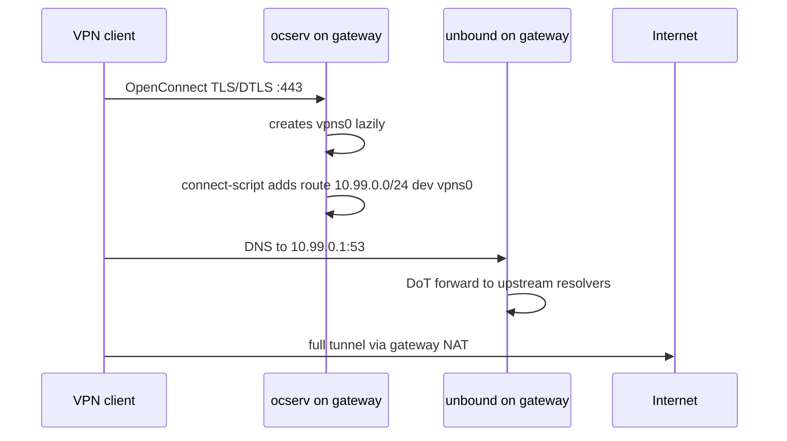
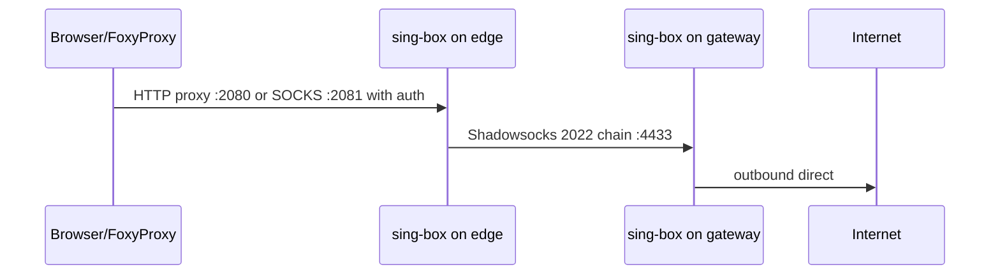
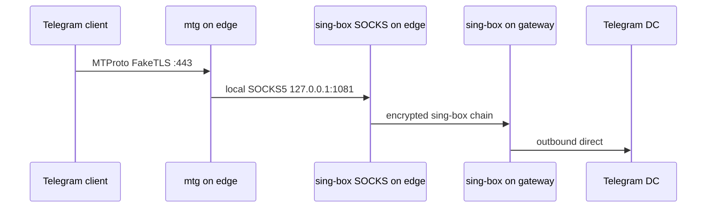

# Архитектура проекта

## Назначение

Проект автоматизирует разворачивание домашней двухузловой VPN/proxy-инфраструктуры на Ubuntu 24.04.

Целевой результат:

- полнотуннельный OpenConnect/AnyConnect VPN для ноутбуков и мобильных клиентов;
- браузерный HTTP/SOCKS proxy для выборочной маршрутизации через FoxyProxy;
- Telegram MTProto proxy на публичном edge-узле;
- egress через отдельный gateway-узел;
- воспроизводимый Ansible-deploy после reboot или переустановки сервера.

## Узлы

| Логическое имя | Inventory group | Назначение | Основные сервисы |
|---|---|---|---|
| Edge VPS | `ru_vps` | публичная точка входа для Telegram и браузерного прокси | nginx, mtg, sing-box |
| Gateway VPS | `de_vps` | VPN concentrator и внешний egress | ocserv, unbound, sing-box |

Названия групп исторические. В публичной версии их можно трактовать как `edge_vps` и `gateway_vps`.

## Потоки трафика

### 1. VPN-клиент -> Gateway -> Internet

### 2. Browser -> Edge proxy -> Gateway -> Internet

### 3. Telegram -> Edge mtg -> Gateway -> Telegram

## Порты

### Edge

| Порт | Протокол | Bind | Сервис | Назначение |
|---:|---|---|---|---|
| 22 | TCP | public | sshd | управление |
| 80 | TCP | public | nginx/certbot | ACME HTTP-01 |
| 443 | TCP | public | mtg/nginx | Telegram MTProto FakeTLS / fronting |
| 1080 | TCP | loopback | sing-box | локальный HTTP proxy |
| 1081 | TCP | loopback | sing-box | локальный SOCKS proxy |
| 2080 | TCP | public | sing-box | HTTP proxy с auth |
| 2081 | TCP | public | sing-box | SOCKS proxy с auth |

### Gateway

| Порт | Протокол | Bind | Сервис | Назначение |
|---:|---|---|---|---|
| 22 | TCP | public | sshd | управление |
| 80 | TCP | public | certbot standalone | ACME HTTP-01 для ocserv |
| 443 | TCP/UDP | public | ocserv | OpenConnect/AnyConnect VPN |
| 4433 | TCP | public, restricted by firewall | sing-box | ingress с edge-узла |
| 53 | TCP/UDP | VPN interface | unbound | DNS для VPN-клиентов |

## Адресация VPN

По умолчанию:

- VPN network: `10.99.0.0/24`
- gateway/DNS: `10.99.0.1`
- ocserv device base: `vpns`
- runtime interface: `vpns0`

Особенность: `vpns0` появляется только после подключения первого клиента. Поэтому постоянный Ansible task вида `ip route replace 10.99.0.0/24 dev vpns0` неидемпотентен на холодном сервере. В проекте маршрут добавляется best-effort hook-скриптом `route-up.sh`, подключенным через `connect-script` в `ocserv.conf`.

## DNS

`unbound` слушает локально на gateway-узле и обслуживает VPN-клиентов. Upstream DNS идет по DoT на публичные резолверы.

Для VPN-клиентов `ocserv` пушит DNS `10.99.0.1` и `tunnel-all-dns = true`.

Важный фикс для Ubuntu/Debian: проект удаляет конфликтующий distro-файл `root-auto-trust-anchor-file.conf` и использует `trust-anchor-file: "/usr/share/dns/root.key"`, чтобы избежать конфликта `auto-trust-anchor-file`.

## Firewall/NAT

Firewall реализован через nftables.

Основные требования:

- разрешить входящие публичные сервисы только на нужных портах;
- разрешить `input` DNS с `vpns0` на `:53`;
- разрешить `forward` из `vpns0` в egress-интерфейс;
- разрешить `forward` established/related обратно в `vpns0`;
- masquerade для `10.99.0.0/24` на gateway egress-интерфейс;
- ограничить sing-box inbound на gateway только edge-IP;
- не допустить open proxy без auth.

## Ansible ownership

| Компонент | Где задается |
|---|---|
| Список пользователей VPN/proxy | `group_vars/all.yml: vpn_users` |
| ocserv config | `roles/de_ocserv/templates/ocserv.conf.j2` |
| ocserv route hook | `roles/de_ocserv/templates/route-up.sh.j2` |
| unbound config | `roles/de_unbound/templates/unbound.conf.j2` |
| nftables ruleset | `roles/firewall/templates/nftables.conf.j2` |
| ocserv NAT | `roles/de_ocserv/templates/ocserv-nat.nft.j2` |
| sing-box edge/gateway | `roles/ru_singbox`, `roles/de_singbox` |
| mtg | `roles/ru_mtg` |

## Что важно показать на интерактивной карте сети

Слои карты:

1. **Nodes** — edge VPS, gateway VPS, clients, upstream DNS, Telegram DC, Internet.
2. **Public ingress** — SSH, ACME, mtg, browser proxy, ocserv.
3. **Encrypted tunnels** — browser/Telegram chain edge -> gateway, VPN client -> gateway.
4. **DNS plane** — VPN client -> unbound -> DoT upstream.
5. **Firewall plane** — input, forward, NAT, edge-IP restriction.
6. **Ansible ownership** — какая роль владеет каким сервисом и файлом.
7. **Runtime state** — `vpns0` появляется только при подключенном клиенте.

## Потенциальные доработки

- Перейти с открытых паролей в `group_vars/all.yml` на Ansible Vault или SOPS.
- Разделить `vpn_users` и `proxy_users`, если появятся разные политики доступа.
- Добавить healthchecks: ocserv login test, DNS test через VPN, proxy egress IP test, mtg doctor.
- Добавить backup/restore для `/etc/ocserv/ocpasswd` и `/etc/mtg/secret`.
- Явно описать IPv6-политику: disabled, routed или filtered.
- Добавить rate limiting для публичных proxy endpoints.
- Добавить fail2ban/nftables dynamic sets для SSH/ocserv brute force.
